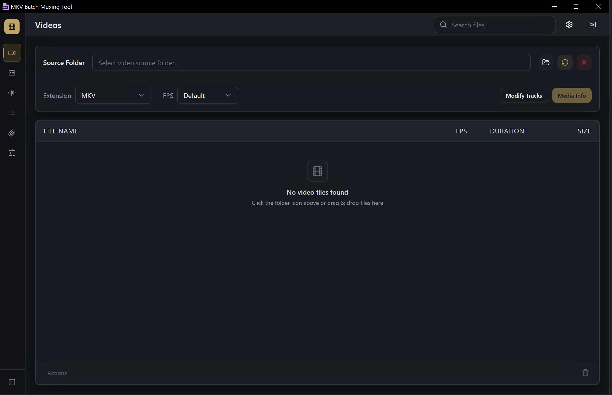
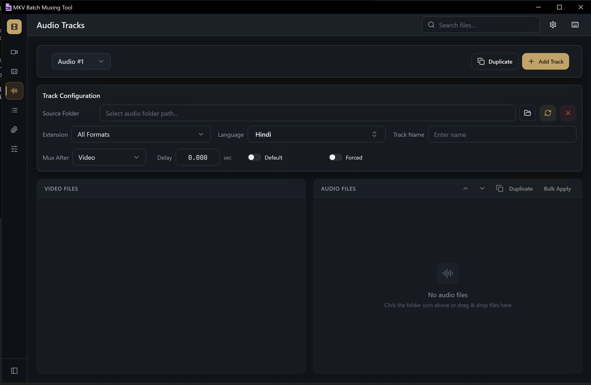
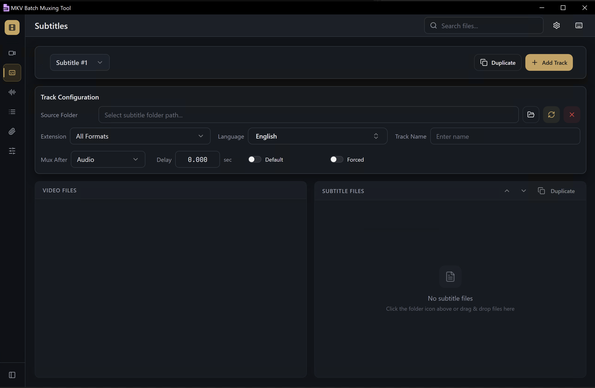
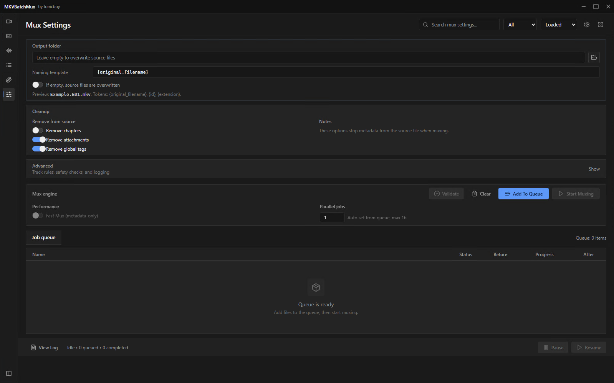

# MKV Batch Muxing Tool

A desktop app for scanning MKV collections and batch muxing with a premium, focused workflow.

## Features
- Scan source folders and auto-load media metadata
- Batch mux using MKVToolNix
- Video, Audio, Subtitle, Chapter, and Attachment tabs with dedicated workflows
- External audio/subtitle injection with per-track overrides
- Multi-track extraction and inclusion from a single external file
- Track language, name, default/forced flags, and per-track delay control
- Track reordering with drag handles in edit dialogs
- Bulk apply external files with selectable track subsets
- Detailed change reports for queued jobs
- Queue management, validation, and progress tracking
- Advanced mux settings (chapters, attachments, tags, safety checks)
- Polished dark cinematic UI (Cinematic Graphite + Soft Gold)
- Tauri desktop app (Windows/macOS/Linux)

## Requirements
- Node.js 20+
- Rust (stable toolchain)
- MKVToolNix (for `mkvmerge` / `mkvpropedit`)
- MediaInfo CLI (for `mediainfo`)

### Optional: delay measurement
The **Measure delays** action measures each external audio track's offset
against the video it will be muxed into, and fills in the delay field for you.
It needs two things:

- **FFmpeg** on your PATH (both `ffmpeg` and `ffprobe`). Detected, not bundled.
- **The AudioSync engine**, built from the
  [AudioSyncMaster](https://github.com/AdkHex/AudioSyncMaster) checkout:

  ```bash
  npm run fetch-engine                              # uses ../AudioSyncMaster
  AUDIOSYNC_REPO=/path/to/AudioSyncMaster npm run fetch-engine
  AUDIOSYNC_ENGINE_DIR=/path/to/prebuilt npm run fetch-engine
  ```

  This builds the engine into `src-tauri/resources/engine/`, which is a build
  artifact and is not committed. The engine is built from that repo rather than
  vendored here so it does not diverge from the fixes made there.

Without either one the button is disabled and explains what is missing;
everything else in the app works normally. In development, if no built engine
is present, the app falls back to running the checkout's `python/bridge.py`
directly, so the feature is usable without a PyInstaller build.

### Windows extras (MSI installer)
- WiX Toolset (required to build `.msi`)

## Installation & Usage

### 1) Install dependencies
```bash
npm ci
```

### 2) Run in development
```bash
npm run dev
```

### 3) Build the desktop app
```bash
npm run tauri:build
```

### 4) Build a Windows MSI installer
```bash
npm run tauri:build -- --bundles msi
```

The MSI will be located under:
```
src-tauri/target/release/bundle/msi/
```

## GitHub Actions (manual build)
This repo ships a manual workflow for building installers. It does not run on every push.

1) Go to the Actions tab  
2) Select **Build installers**  
3) Click **Run workflow**

Artifacts will be attached to the workflow run.

---

## Project Structure
```text
src/
  app/        App entry, routes, and global styles
  features/   Workspace, history, and session-specific code
  shared/     Reusable UI, shared components, utilities, types, and data
src-tauri/    Rust backend and Tauri configuration
docs/         Project documentation assets such as screenshots
scripts/      Project maintenance scripts
```

---

## Credits
- Ionicboy (AdkHexx)

## Screenshots




