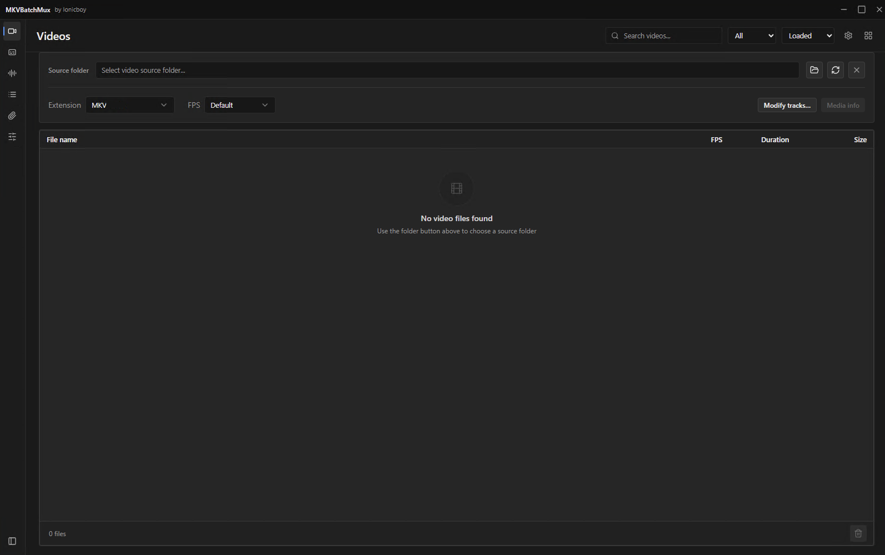
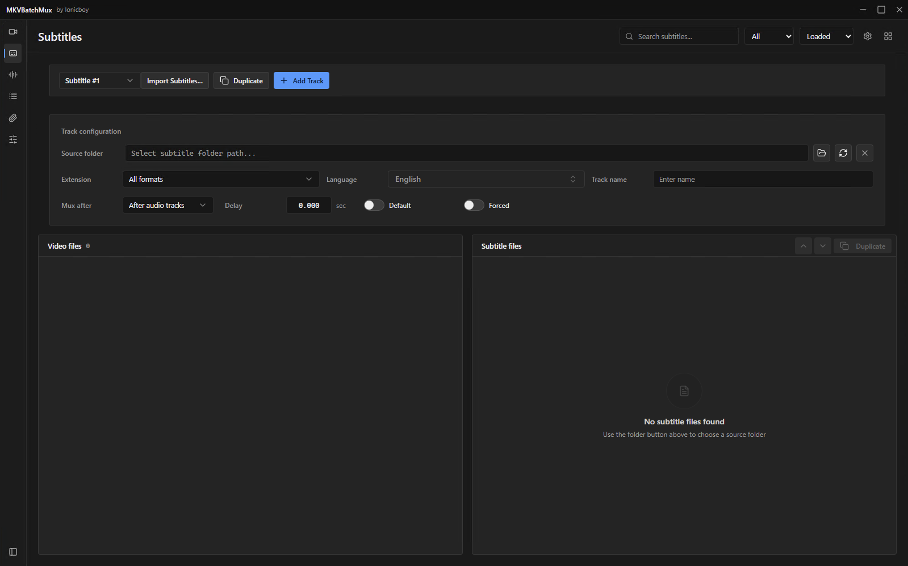
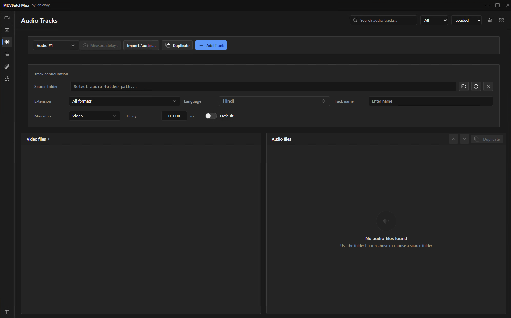
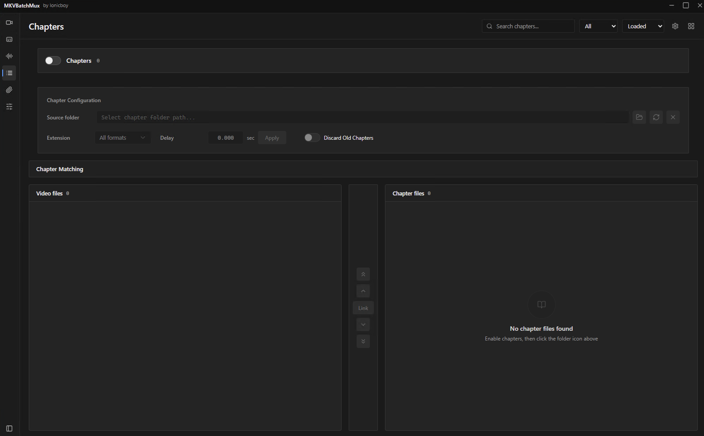
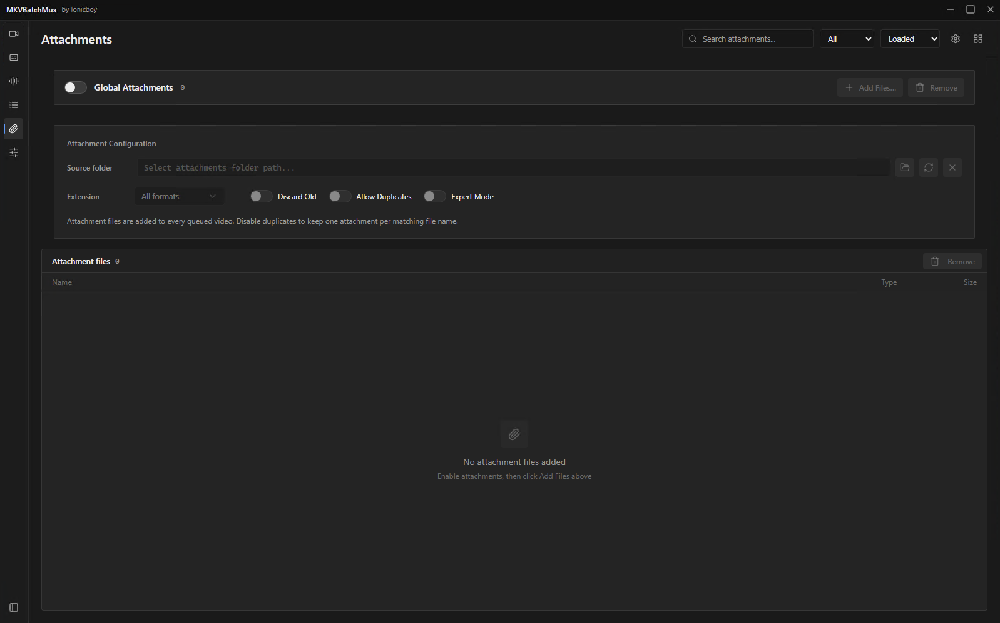

# MKVBatchMux

**Batch-mux a whole folder of MKVs at once.** Point it at your videos, your
audio tracks, subtitles, chapters and attachments, set the flags and delays
once, and let it run through the queue with MKVToolNix.

[](https://github.com/AdkHex/MkvBatchMux/releases/latest)
[](LICENSE)

- **Windows x64** — installer on the [Releases](https://github.com/AdkHex/MkvBatchMux/releases/latest) page
- **macOS / Linux** — build from source (untested, not shipped)

---

## Screenshots

<details>
<summary><b>Show screenshots</b></summary>
<br>

**Videos**



**Subtitles**



**Audio Tracks**



**Chapters**



**Attachments**



**Mux Settings**


</details>

---

## Features

| | |
|---|---|
| **Batch muxing** | Scan a folder, auto-load metadata, queue every file, mux with MKVToolNix |
| **One tab per track type** | Video, Audio, Subtitle, Chapter and Attachment tabs, each with its own workflow |
| **External tracks** | Inject audio and subtitles from separate files, with per-track overrides |
| **Multi-track sources** | Pick and include several tracks from a single external file |
| **Full track control** | Language, name, default flag, delay, and drag-to-reorder |
| **Import from another video** | Per-stream language, name and delay when pulling tracks out of another MKV |
| **Measured delays** | Measure each external audio track's offset against its video and fill the delay in for you |
| **Safe queue** | Validation, change reports, progress tracking, pause and resume |
| **Advanced mux settings** | Chapters, attachments, tags, safety checks |
| **Calm dark UI** | Live dependency and update status in Settings |

---

## Install (Windows)

1. Download `MKVBatchMux_<version>_x64-setup.exe` from the
   [latest release](https://github.com/AdkHex/MkvBatchMux/releases/latest).
2. Run it. The installer is not yet code-signed, so SmartScreen shows
   *"Windows protected your PC"* the first time — click **More info → Run anyway**.
3. Open the app. If **MKVToolNix** or **MediaInfo** are missing it offers to
   download them from their official sites (Settings → Dependencies).

**FFmpeg and the delay-measurement engine are bundled** — nothing else to install.

> Every release lists the installer's SHA-256 in its notes, and the app only
> accepts updates signed with the key in `src-tauri/tauri.conf.json`.

### Automatic updates

Installed builds check GitHub Releases shortly after launch and every six
hours, and offer a newer version as a toast with an **Install** action.
Settings also has **Check now**.

Nothing installs without being asked. Checks are skipped while a mux batch is
running, and each version is offered once per session — installing restarts
the app, and a batch can be minutes from finishing.

---

## Measuring delays

**Measure delays** (Audio tab) measures each external audio track's offset
against the video it will be muxed into and fills in the delay field. It uses
the same analysis engine as
[AudioSyncMaster](https://github.com/AdkHex/AudioSyncMaster), and is built to
report the **same number** for the same files:

- The engine is pinned to an AudioSyncMaster **release** (`v2.8.0`), never to
  its `main` branch. Settings → *Audio analysis engine* shows the stamp.
- The measurement parameters are AudioSyncMaster's defaults, and the request
  is the one it sends.
- The reference track defaults to the video's **first audio stream**, as in
  AudioSyncMaster. Choose another in the *Reference audio track* panel.
- FFmpeg decodes the audio, and the build matters: builds differ in whether
  they trim E-AC3 / AC-3 / TrueHD decoder priming inside a container, which
  shifts every delay on such a track by a constant tens of milliseconds.
  AudioSyncMaster uses the FFmpeg installed on your machine, so this app does
  too: it searches your PATH, the registry PATH and the winget/Chocolatey/Scoop
  locations, and only falls back to the bundled copy when none is found.
  Settings → Dependencies shows which `ffmpeg.exe` is in use.

<details>
<summary>The one deliberate difference from AudioSyncMaster</summary>
<br>

The row shows the delay **at the start of the file** (`delayAtStartMs`),
which is the value `--sync` applies and the value AudioSyncMaster's own *Fix*
applies. AudioSyncMaster's headline is the mid-file value; the two only differ
on a file flagged *Drift*, where its detail panel shows the same start value
as *Applied from t=0*.

</details>

A result is measured and shown but **not filled in** when the engine flags a
different cut, the offset is over 10 seconds, or the confidence is below 50 %.
Each of those has an **Apply anyway** action once you've checked the files.

---

## Building from source

### Requirements

| Tool | Needed for |
|---|---|
| Node.js 20+ | Frontend and build scripts |
| Rust (stable) | Tauri backend |
| MKVToolNix | `mkvmerge` / `mkvpropedit` |
| MediaInfo CLI | `mediainfo` |

### Commands

```bash
npm ci                                  # install dependencies
npm run dev                             # run in development
npm run tauri:build                     # build the desktop app
npm run tauri:build -- --bundles nsis   # build the Windows installer
```

The installer lands in `src-tauri/target/release/bundle/nsis/`. No extra
toolchain is needed; the bundler ships its own NSIS.

### Delay measurement in a dev checkout

Neither FFmpeg nor the engine is present by default. The app falls back to
whatever `ffmpeg`/`ffprobe` are on your PATH, and to running AudioSyncMaster's
`python/bridge.py` directly, so the feature is usable without a PyInstaller
build. To mirror a release build locally:

```bash
npm run fetch-ffmpeg                              # downloads a static build
FFMPEG_DIR=/path/to/bin npm run fetch-ffmpeg      # or copy from a local dir

npm run fetch-engine                              # uses ../AudioSyncMaster
AUDIOSYNC_REPO=/path/to/AudioSyncMaster npm run fetch-engine
AUDIOSYNC_ENGINE_DIR=/path/to/prebuilt npm run fetch-engine
```

These write into `src-tauri/resources/ffmpeg/` and `src-tauri/resources/engine/`.
Both are build artifacts and are not committed.

<details>
<summary>How the engine pin works, and how to move it</summary>
<br>

`package.json` names the AudioSyncMaster release the engine is built from:

```json
"audiosyncEngine": { "repository": "AdkHex/AudioSyncMaster", "ref": "v2.8.0" }
```

CI checks that tag out, `fetch-engine` refuses a checkout at any other commit
or with uncommitted engine changes, and the built engine is stamped with its
version (`ENGINE_VERSION`). CI also measures a fixture with the bundled
engine before building the installer, so a release can never go out with the
feature quietly broken.

Why it matters: building from AudioSyncMaster's `main` once shipped an
unreleased engine rewrite that flagged cuts and drift on files the released
engine measured cleanly, and the two apps disagreed by tens of milliseconds
with nothing on screen to say why.

- **To move to a newer engine**, bump `audiosyncEngine.ref` to the new release
  tag in a commit of its own. CI warns when AudioSyncMaster has a newer
  release than the pin.
- **To try an unreleased checkout locally**, set `AUDIOSYNC_ALLOW_UNPINNED=1`.
  The stamp then says so, and the Measure button warns that results may
  differ from AudioSyncMaster's.

</details>

### Releases and CI

Every push and pull request runs **CI** (typecheck, lint, tests, `cargo check`).
Documentation-only changes are skipped.

A release is cut from a tag:

```bash
npm run release -- minor --push     # or patch / major / 1.65.0
```

This writes the version into `package.json`, `tauri.conf.json` and
`Cargo.toml`, commits `Release vX.Y.Z`, tags it and pushes. The **Release**
workflow then builds the Windows installer with the bundled FFmpeg and engine,
signs the updater bundle, and publishes a GitHub release marked *latest* —
installed apps pick it up automatically. Release notes are the commit subjects
since the previous tag.

<details>
<summary>Repository secrets (required for auto-update)</summary>
<br>

Updates are cryptographically signed and the app rejects unsigned ones, so CI
needs two secrets. Without them the build still succeeds and publishes an
installer for manual download, but no `latest.json` is generated and
auto-update stays off (the workflow logs a warning saying so).

| Secret | Value |
|---|---|
| `TAURI_PRIVATE_KEY` | Contents of the updater private key file |
| `TAURI_KEY_PASSWORD` | The key's password (empty string if none) |

**Keep the private key safe.** If it is lost, already-installed apps can no
longer be updated — every user would have to reinstall by hand. The matching
public key lives in `src-tauri/tauri.conf.json` under `tauri.updater.pubkey`.

To generate a fresh keypair (this invalidates existing installs):

```bash
npx tauri signer generate -w ~/.tauri/mkvbatchmux.key
```

</details>

### Project structure

```text
src/
  app/        App entry, routes, and global styles
  features/   Workspace, history, and session-specific code
  shared/     Reusable UI, shared components, utilities, types, and data
src-tauri/    Rust backend and Tauri configuration
docs/         Project documentation and screenshots
scripts/      Project maintenance scripts
```

---

## License

Copyright (c) 2026 Ionicboy (AdkHex). All rights reserved — see [LICENSE](LICENSE).
The source is published for reference; the installer is free to download and use.

The installer bundles FFmpeg (LGPL) and the AudioSync analysis engine, and can
download MKVToolNix (GPL) and MediaInfo (BSD) on request. See
[THIRD_PARTY_NOTICES.md](THIRD_PARTY_NOTICES.md) for each component's license
and where to get its source.
